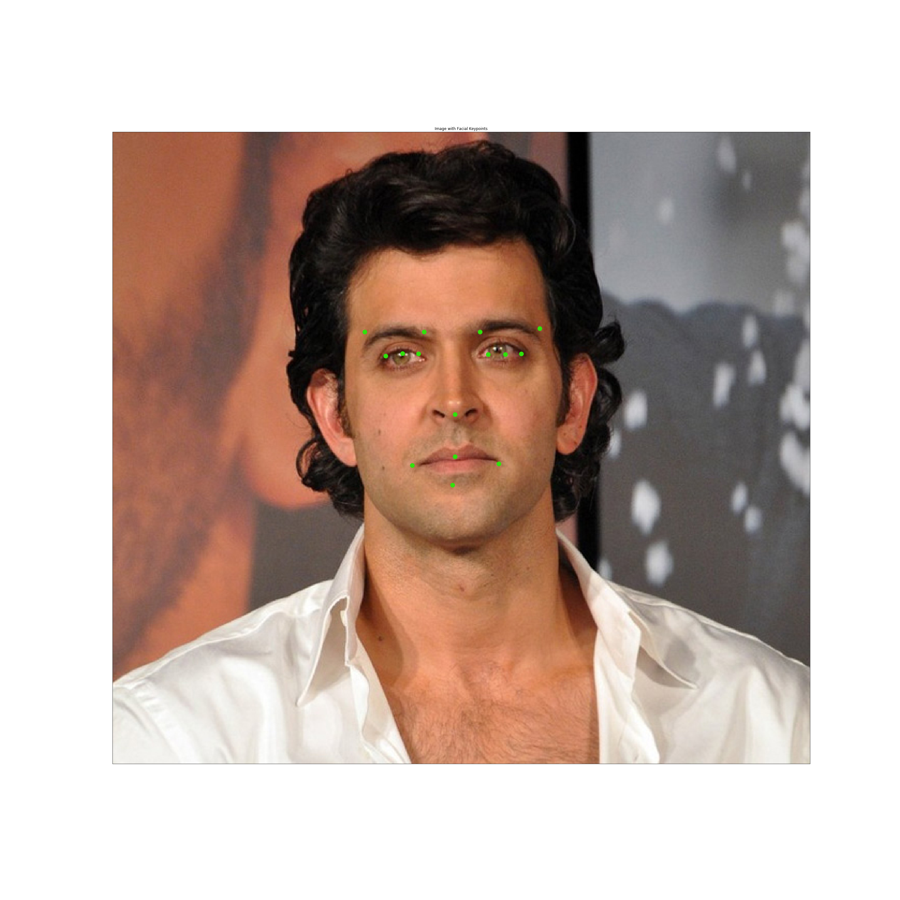
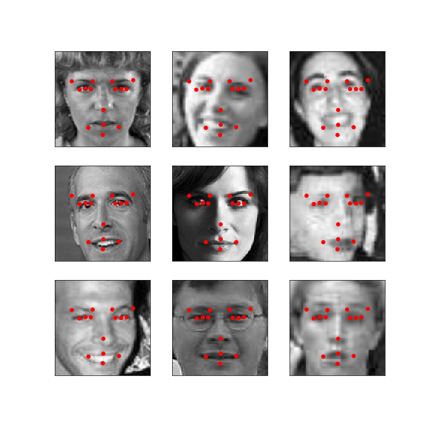
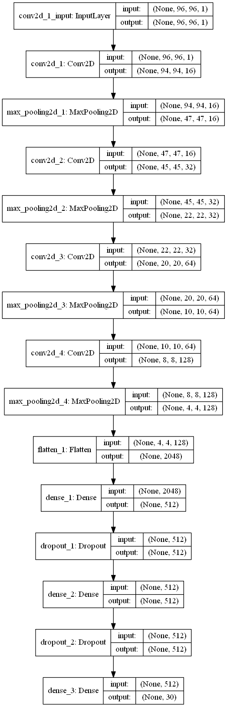

# <u>Facial Keypoint Detection</u>

I have made a Facial Keypoints Regressor that regresses the keypoints for human face. This keypoint detection problem is a regression problem since we are predicting the coordinates for the landmarks on the face which are real numbers. 
Detection of facial keypoints is very useful for a number of tasks like facial recognition, detection etc. The keypoints selected in this code uses 15 keypoints representing the various coordinates on the human face. 
The dataset for this problem was downloaded from Kaggle https://www.kaggle.com/c/facial-keypoints-detection/. 

CNN was used for this problem. The model achieved an accuracy of 76% on the validation set. The model was trained on a set of approx 1700 images and around 300 images were taken for validation purpose. The images were grayscale and had shape 96 X 96. 

## Model Performance on real world data
Predictions for some real world color images.

&nbsp;&nbsp;&nbsp;&nbsp;&nbsp;

&nbsp;&nbsp;&nbsp;&nbsp;&nbsp;

## Model Performance on Validation data
Predictions for some validation images.

## Model Architecture
The model uses a CNN based Architecture.

  

### References
Dataset downloaded from Kaggle https://www.kaggle.com/c/facial-keypoints-detection/. 
